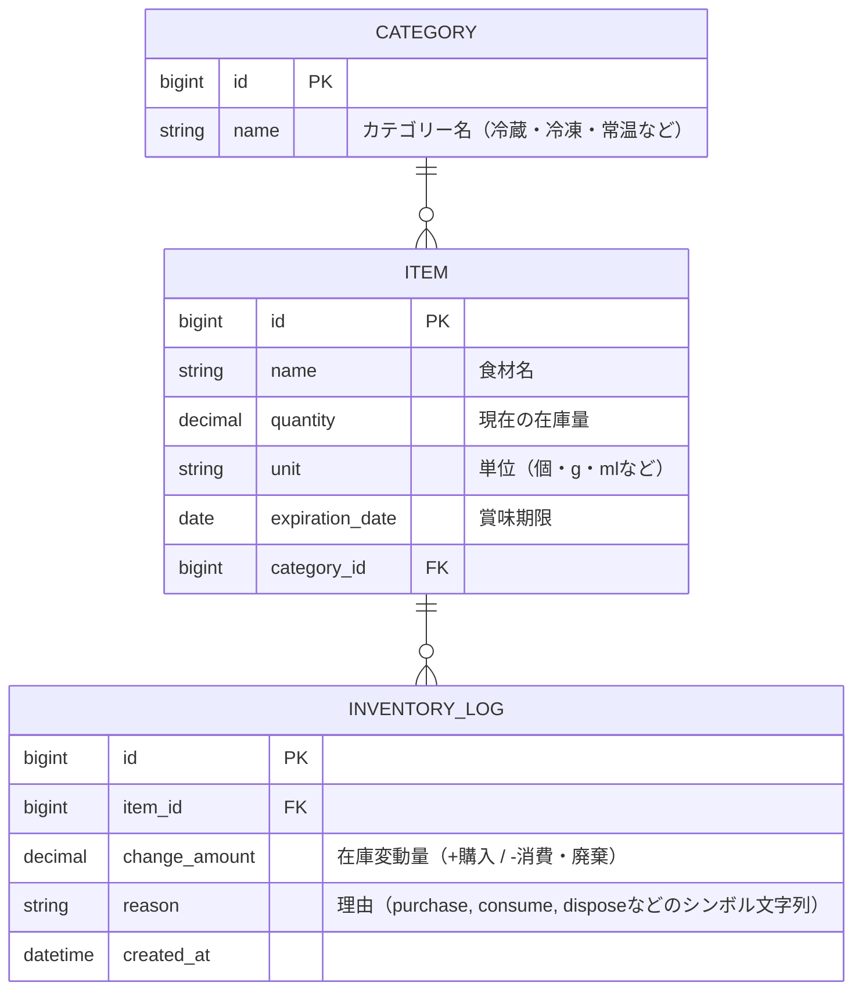

# ManagePantry ドキュメント
## 要件
### 目的
食材の在庫を見える化したり、賞味期限切れを防ぎたい！！（ほんだし3つ買ったり、めんつゆ腐らせたりしないように！）

## 機能
|機能|内容|優先度|
|--|--|--|
|在庫管理|食材の名前、数量、賞味期限、カテゴリーの登録、編集、削除|必須|
|期限アラート|賞味期限が３日以内の食材をハイライト|必須|
|在庫のログ|在庫の増減（消費・購入・破棄などなど）を履歴として記録|必須|
|カテゴリー分類|冷蔵、冷凍、常温などのカテゴリーによる分類|必須|
|ユーザー認証|ユーザーごとに在庫を管理|時間的にできたら|

## データベース設計
在庫管理用の設計（ユーザー紐付けもできたらしたい）

## ユースケース・操作フロー

### 主なユースケース
- 在庫一覧を確認する
- 新しい食材を登録する
- 食材の情報（数量・賞味期限・カテゴリー）を編集する
- 食材を削除する
- 在庫の増減（購入・消費・廃棄）を記録する
- 賞味期限が近い食材を確認する（アラート表示）
- カテゴリーごとに食材を分類・閲覧する
- （将来的に）ユーザーごとに在庫を管理する

### 操作フロー例
1. ユーザーが在庫一覧画面を開く
2. 必要に応じて「新規登録」から食材を追加
3. 食材の数量や賞味期限を編集、または削除
4. 食材を消費・購入・廃棄した際は「在庫ログ」から記録
5. 賞味期限が近い食材はハイライト表示で注意喚起
6. カテゴリーで絞り込み・分類表示

---

## 画面設計・API設計

### 画面設計
- 在庫一覧画面
    - 食材名、数量、単位、賞味期限、カテゴリー、アラート表示
    - 編集・削除ボタン、在庫増減ボタン
- 食材登録・編集画面
    - 名前、数量、単位、賞味期限、カテゴリー選択
- 在庫ログ画面
    - 食材ごとの履歴一覧（購入・消費・廃棄の記録）
- カテゴリー管理画面
    - カテゴリーの追加・編集・削除

### API設計
#### Items（食材）
- GET    /items         : 食材一覧取得
- POST   /items         : 食材新規登録
- GET    /items/:id     : 食材詳細取得
- PATCH  /items/:id     : 食材情報更新
- DELETE /items/:id     : 食材削除

#### InventoryLogs（在庫ログ）
- GET    /items/:item_id/inventory_logs : 指定食材の在庫ログ一覧
- POST   /items/:item_id/inventory_logs : 在庫変動の記録

#### Categories（カテゴリー）
- GET    /categories     : カテゴリー一覧取得
- POST   /categories     : カテゴリー新規登録
- PATCH  /categories/:id : カテゴリー編集
- DELETE /categories/:id : カテゴリー削除

---

## クラス設計

### モデル
- **Category**
    - 属性: id, name
    - 関連: has_many :items

- **Item**
    - 属性: id, name, quantity, unit, expiration_date, category_id
    - 関連: belongs_to :category, has_many :inventory_logs
    - 主なメソッド:
        - expired?: 賞味期限切れか判定
        - near_expiration?: 賞味期限が近いか判定
        - update_stock!(delta): 在庫を増減する（負の値も許容）

- **InventoryLog**
    - 属性: id, item_id, change_amount, reason, created_at
    - 関連: belongs_to :item
    - 主なメソッド:
        - self.record(item:, delta:, reason_key:): 在庫変動を記録する
        - inventory_reason_delta: InventoryReasonDelta ValueObjectを取得する

- **InventoryReasonDelta**
    - 属性: reason_key (purchase, consume, dispose)
    - 役割: 在庫変動の理由を表すValue Object。理由に応じた在庫変動量（delta）を計算する。

### コントローラー
- **CategoriesController**: カテゴリーのCRUD
- **ItemsController**: 食材のCRUD、賞味期限アラート、カテゴリー絞り込み
- **InventoryLogsController**: 在庫変動の記録・履歴表示

### ユースケース
- **Inventory::ChangeStockUsecase**
    - 役割: 食材の在庫を変動させるビジネスロジックをカプセル化する。在庫変動量の計算、在庫の更新、在庫ログの記録を行う。

### サービス・その他（必要に応じて）
- 賞味期限アラート判定サービス
- 在庫集計・統計サービス

---