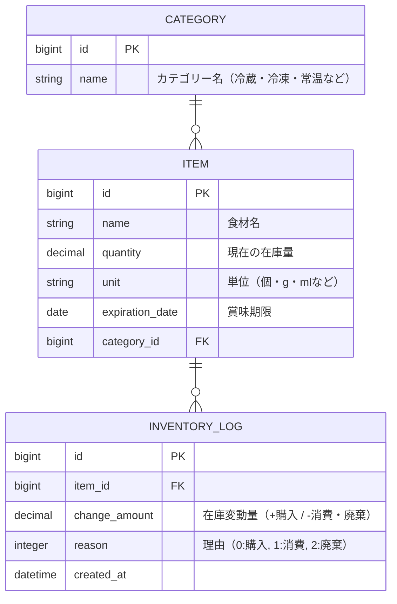

# ManagePantry ドキュメント
## 要件
### 目的
食材の在庫を見える化したり、賞味期限切れを防ぎたい！！（ほんだし3つ買ったり、めんつゆ腐らせたりしないように！）

## 機能
|機能|内容|優先度|
|--|--|--|
|在庫管理|食材の名前、数量、賞味期限、カテゴリーの登録、編集、削除|必須|
|期限アラート|賞味期限が３日以内の食材をハイライト|必須|
|在庫のログ|在庫の増減（消費・購入・破棄などなど）を履歴として記録|必須|
|カテゴリー分類|冷蔵、冷凍、常温などのカテゴリーによる分類|必須|
|ユーザー認証|ユーザーごとに在庫を管理|時間的にできたら|

## データベース設計
在庫管理用の設計（ユーザー紐付けもできたらしたい）

## クラス設計